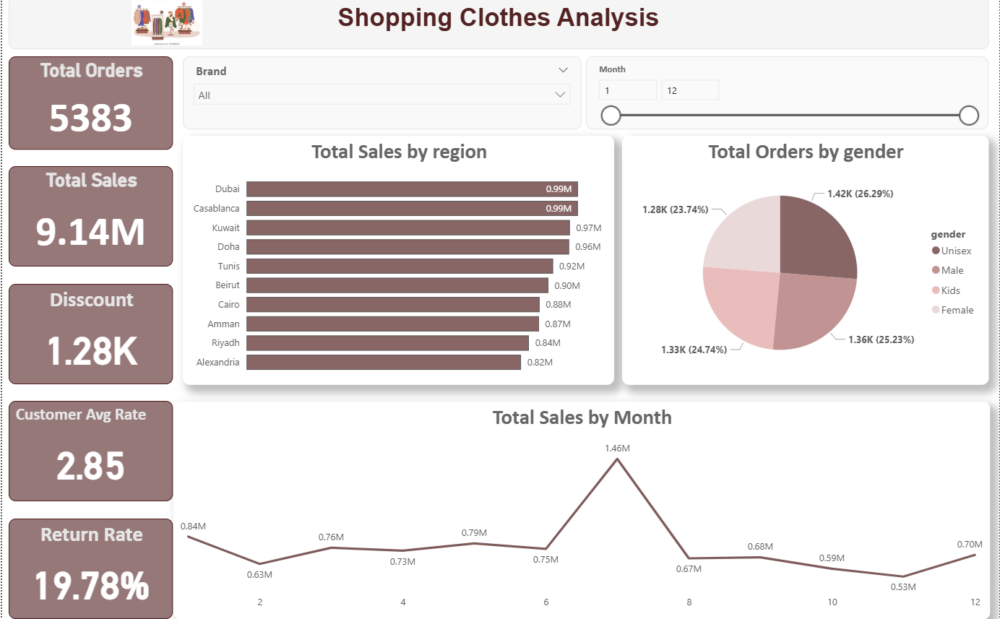
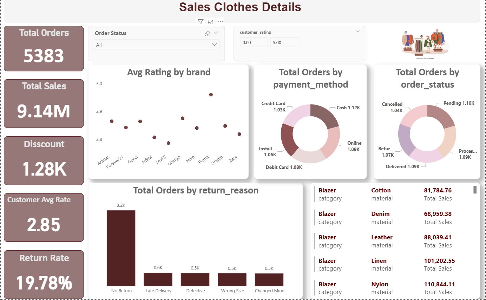

# Shopping Clothes Analysis Clean & Dashboard

## 📌 Project Overview

This project analyzes an e-commerce fashion dataset to uncover valuable business insights related to:
- Sales performance
- Customer behavior
- Product returns
- Shipping efficiency
- Payment preferences
- Regional sales trends

The project covers the complete analytics lifecycle:
- Raw Data
- Data Cleaning
- Exploratory Data Analysis (EDA)
- Feature Engineering
- Dashboard Development

---

# Business Objectives

The main objectives of this project are:

- Analyze total sales and order performance
- Understand customer satisfaction using ratings
- Detect operational issues affecting returns
- Identify top-performing regions and brands
- Monitor shipping and delivery performance
- Improve business decisions using data-driven insights

---

#  Dataset Information

The dataset contains transactional records from a fashion e-commerce platform.

## Main Features

| Column | Description |
|---|---|
| order_id | Unique order identifier |
| product_name | Product name |
| category | Product category |
| brand | Brand name |
| color | Product color |
| size | Product size |
| gender | Target gender |
| material | Product material |
| season | Product season |
| unit_price | Product price |
| discount | Discount applied |
| quantity | Purchased quantity |
| total_sales | Total sales amount |
| order_date | Order date |
| shipping_date | Shipping date |
| region | Customer region |
| payment_method | Payment method |
| order_status | Order status |
| customer_rating | Customer rating |
| return_reason | Reason for return |

---

#  Data Cleaning 

The dataset contained multiple real-world inconsistencies and quality issues.

##  Cleaning Steps

###  Product Name Cleaning
- Removed extra spaces
- Fixed spelling mistakes
- Standardized product names
- Removed color names from product titles

Examples:
- `Huddie` → `Hoodie`
- `Jeen` → `Jeans`
- `tshirt` → `T-Shirt`

---

###  Region Standardization
Unified:
- Different spellings
- Arabic/English names
- Upper/lower case variations

Examples:
- `Cario` → `Cairo`
- `Alex` → `Alexandria`
- `دبي` → `Dubai`

---

### Payment Method Cleaning
Standardized payment methods:
- `cash` → `Cash`
- `online` → `Online`
- `debit card` → `Debit Card`

---

###  Gender Cleaning
Unified gender values:
- `MALE` → `Male`
- `women` → `Female`
- `childrens` → `Kids`

---

### Numerical Cleaning

#### Unit Price
- Removed currency symbols
- Converted to numeric datatype
- Flagged negative values

#### Discount
Converted:
- `36%` → `0.36`

#### Customer Rating
Extracted numeric ratings:
- `4.5/5` → `4.5`

Handled invalid ratings:
- Ratings above 5 capped to 5

---

###  Date Cleaning
Handled mixed date formats:
- DD/MM/YYYY
- YYYY-MM-DD
- Month-name formats

Converted using:
```python
pd.to_datetime(errors='coerce')
```

---

### Data Quality Issues Detected

| Issue | Solution |
|---|---|
| Negative prices | Cleaned/flagged |
| Negative quantities | Removed |
| Invalid ratings | Fixed |
| Shipping before order date | Flagged |
| Mixed categorical values | Standardized |

---

#  Feature Engineering

Created new features for deeper analysis:

| Feature | Description |
|---|---|
| year | Order year |
| month | Order month |
| weekday | Day name |
| shipping_days | Delivery duration |
| invalid_price_flag | Detect invalid prices |
| negative_sales_flag | Detect negative sales |

---

#  Exploratory Data Analysis (EDA)

##  KPIs Used

| KPI | Description |
|---|---|
| Total Sales | Overall revenue |
| Total Orders | Number of orders |
| Avg Customer Rating | Customer satisfaction |
| Return Rate | Percentage of returned orders |
| Avg Shipping Time | Delivery performance |

---

#  Dashboard Insights

##  Sales Analysis
- Dubai and Casablanca generated the highest sales revenue.
- Alexandria showed the lowest sales among major regions.

---

##  Customer Analysis
- Average customer rating is relatively low (~2.85).
- Lower ratings strongly correlate with returned orders.

---

##  Return Analysis
Main return reasons:
- Wrong Size
- Defective Product
- Changed Mind
- Late Delivery

---

##  Payment Analysis
Most common payment methods:
- Cash
- Online
- Debit Card

---

##  Seasonal Trends
- Peak sales occurred during Month 7.
- Significant sales drop observed after Month 8.

---

#  Dashboard Preview

## Executive Dashboard



---

## Detailed Sales Dashboard




---

#  Key Business Insights

##  Insight 1
Shipping delays negatively affect customer satisfaction and increase return probability.

---

##  Insight 2
Sizing inconsistency is one of the primary reasons for product returns.

---

##  Insight 3
Heavy discounting increases sales volume but may reduce profitability.

---

##  Insight 4
Certain regions generate strong revenue while simultaneously having higher return rates.

---

#  Business Recommendations

- Improve product sizing standards
- Reduce shipping delays
- Standardize data entry processes
- Optimize discount strategies
- Improve quality control processes

---

#  Technologies Used

- Python
- Pandas
- NumPy
- Power BI
- DAX


---

#  Conclusion

This project demonstrates a complete real-world data analytics workflow starting from raw messy data to a professional interactive dashboard.

The analysis provided actionable business insights that can improve:
- Operational efficiency
- Customer satisfaction
- Revenue performance
- Return management

---